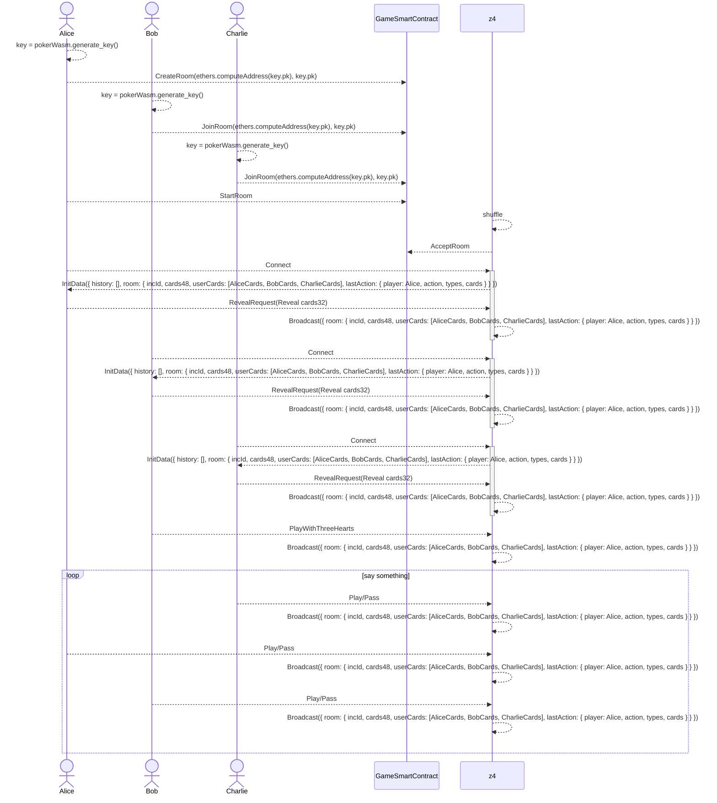

# porker0-frontend

1. 扫描链上RoomMarket合约(https://github.com/zypher-game/z4/blob/main/contracts/solidity/contracts/RoomMarket.sol#L21)，可以展示所有room状态
2. 用户可以create room（https://github.com/zypher-game/z4/blob/main/contracts/solidity/contracts/RoomMarket.sol#L108） ，也可以join链上存在的room（https://github.com/zypher-game/z4/blob/main/contracts/solidity/contracts/RoomMarket.sol#L125）
3. 创建room的玩家可以start room
4. start room之后，会有节点去accept room （节点是通过监听链上合约事件去accept room）
5. 节点去accept room之后 会在本地shuffle，将洗牌的结果发到链上，https://github.com/zypher-game/z4/blob/main/contracts/solidity/contracts/RoomMarket.sol#L156这里的 params是shuffle之后的扑克牌，这里也包含了节点的http信息
6. 接下来 就是玩牌，玩家会将每一轮的出牌信息签名（wasm）发送给节点

wasm :
create_play_env 接口：用户出牌(play)和不要(pass)都需要调用这个接口，把生成的信息发给z4节点。
对这个接口的参数说明：
room_id： 房间号，
每场扑克牌有多轮，每轮有多个回合，round_id代表轮，turn_id代表回合，round_id 和turn_id 都是从0自增的
action ： 0表示play，1表示pass
types ： 表示出牌类型，0 : Single, 1 : Pair, 2 : ConnectedPairs, 3 : Three, 4 : ThreeWithOne, 5 : ThreeWithPair, 6 : Straight, 7 : FourWithTwo, 8 : Bomb, 9 : AAA.
play_cards ： 数组表示，需要注意⚠️的是这个数组是有顺序的，比如三带一，只能是333A, 不能是A333或33A3...，连对是334455，顺子是5678910等等

unmask_card接口返回的是索引，从0开始，对应的顺序为[♣3,♦3,♥3,♠3,♣4,♦4,♥4,♠4,♣5,♦5,♥5,♠5,♣6,♦6,♥6,♠6,♣7,♦7,♥7,♠7,♣8,♦8,♥8,♠8,♣9,♦9,♥9,♠9,♣10,♦10,♥10,♠10,♣J,♦J,♥J,♠J,♣Q,♦Q,♥Q,♠Q,♣K,♦K,♥K,♠K,♦A,♥A,♠A,♥2]

node：

1. 发牌：节点accept room之后 会在本地shuffle，将洗牌的结果发到链上，https://github.com/zypher-game/z4/blob/main/contracts/solidity/contracts/RoomMarket.sol#L156这里的 params是shuffle之后的扑克牌， 前16张分配给第一个用户，16到32分配给第二个用户，32到48分配给第三个用户，用户在房间的的座位顺序按照加入房间的顺序排列。
2. websock：具体格式参考引用部分，目前有四个接口，其method分别为 "play" 出牌，“pass” 不要，“revealRequest”：开牌请求，"revealResponse"： 开牌响应。 稍后会给出具体的json格式

play 和 pass ：["player_env"] 其中player_env是create_play_env 接口生成的字符串
revealRequest ： ["e1.0","e1.1","e2.0","e2.0"] 其中e1和 e2 分别是密文卡牌的e1 e2
revealResponse : [[1,2,3,4,5,6,7,8,9,1,2,3,4,5,6,7,8,9,0,0],["e1.0","e1.1","e2.0","e2.0"],["reveal_card.0","reveal_card.1"], "reveal_proof","public_key"] 其顺序为peerId（发送revealRequest的人）, crypto_card, reveal_card, reveal_proof, public_key（解密卡牌 本地生成的key）

更新接口：
online : 返回 [所有玩家的手牌，游戏信息，开牌信息, 历史记录]
offline ： 离线通知 [ peerId]  
revealRequest : [ ["e1.0","e1.1","e2.0","e2.0"] ]
revealResponse : [ [ peerId] , [ ["e1.0","e1.1","e2.0","e2.0"],["reveal_card.0","reveal_card.1"], "reveal_proof","public_key"] ]
